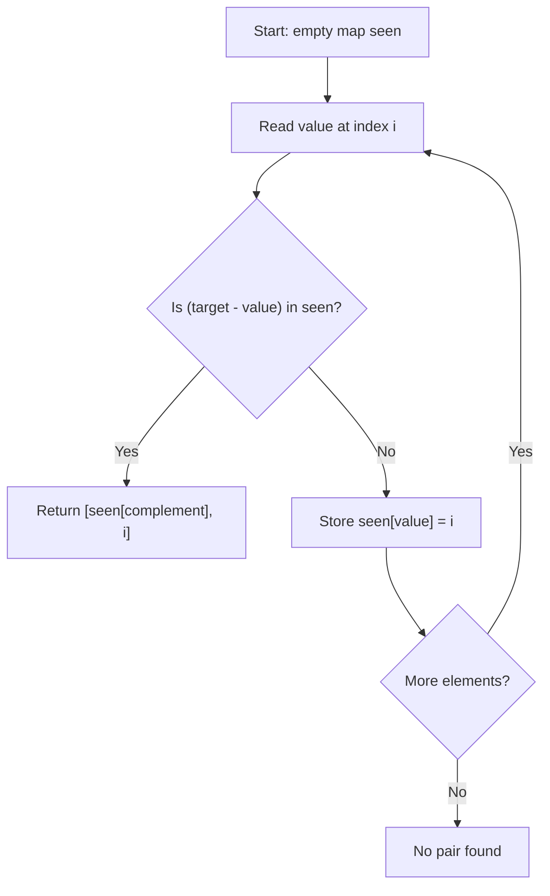

# HashMap Complement Pattern Theory

This note explains the core idea behind **HashMap Complement Pattern** in beginner-friendly language.

## Why this pattern matters

Interviewers test whether you can avoid checking every pair. For each value `x`, the partner you need is `target - x`. A hash map remembers what you have already seen so each lookup is O(1) on average.

## Core mental model

1. Scan the array once.
2. For each value, ask: **"Have I already seen the complement?"**
3. If yes, return the pair. If no, store the current value and its index.

## Pattern diagram



### Two Sum dry run (target = 9)

```
Index:  0   1   2   3
Array: [2] [7] [11] [15]
        ^
        i=0: complement=7, not in map → store {2:0}

Index:  0   1   2   3
Array: [2] [7] [11] [15]
            ^
        i=1: complement=2, found at index 0 → return [0, 1]
```

## Recognition clues

- "Find two numbers that sum to target"
- "Check if duplicate exists"
- Need O(n) pair lookup without sorting first

## Questions in this folder

- [Two Sum (#1)](https://leetcode.com/problems/two-sum/)
- [Contains Duplicate (#217)](https://leetcode.com/problems/contains-duplicate/)
- [Two Sum II - Input Array Is Sorted (#167)](https://leetcode.com/problems/two-sum-ii-input-array-is-sorted/)

## How to explain in interview

1. Mention brute force: nested loops O(n²).
2. State bottleneck: repeated "have we seen complement?" checks.
3. Present hash map: one pass, O(n) time, O(n) space.
4. Walk through one dry run (see diagram above).
5. Share complexity with reason.
