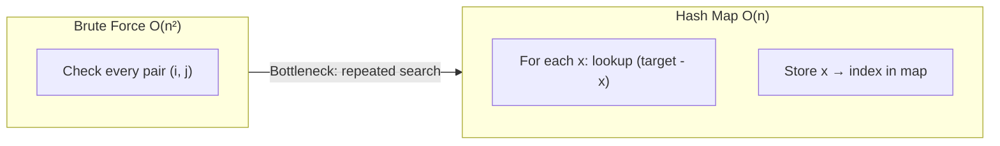

# HashMap Complement Pattern Notes

## Top Interview Questions

- [Two Sum (#1)](https://leetcode.com/problems/two-sum/)
- [Contains Duplicate (#217)](https://leetcode.com/problems/contains-duplicate/)
- [Two Sum II - Input Array Is Sorted (#167)](https://leetcode.com/problems/two-sum-ii-input-array-is-sorted/)

## Visual summary



### Complement lookup at each step

```
nums = [3, 2, 4], target = 6

Step 1: x=3, need 3 → map {}        → store {3:0}
Step 2: x=2, need 4 → map {3:0}     → store {3:0, 2:1}
Step 3: x=4, need 2 → found at idx 1 → answer [1, 2]
```

## Revision in 5 minutes

- Clue: pair sum or duplicate check → think hash map.
- Template: `complement = target - x`; check map before insert.
- Dry run: trace map contents after each index.
- Edge cases: same element used twice? negative numbers? empty array?
- Complexity: O(n) time, O(n) space.

## Revision in 1 minute

- Clue → complement = target - x → map lookup → store → O(n)

## Most Important Concepts

- **Invariant:** map holds all values seen *before* current index.
- **Why safe:** you never pair an element with itself (check before insert).
- **Contains Duplicate:** same idea — if value already in set, return true.
- **Two Sum II:** sorted array → two pointers can replace the map.
