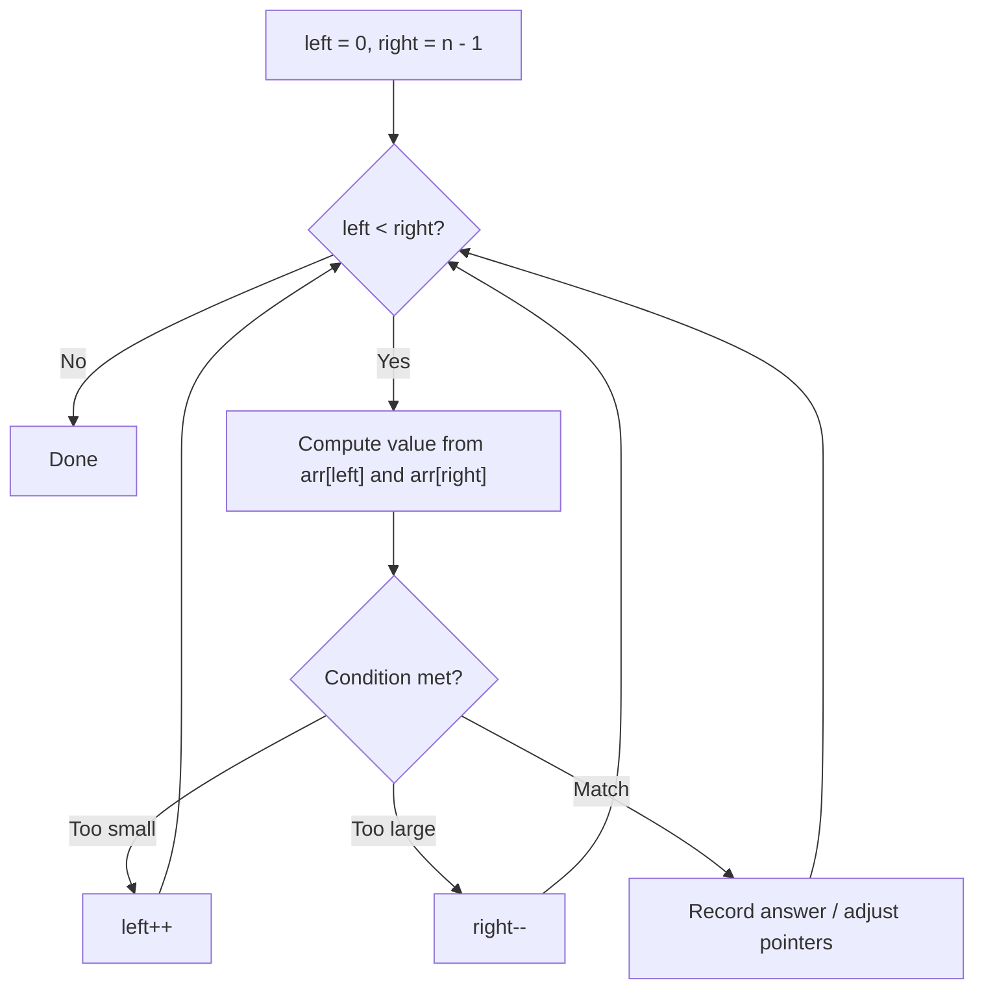
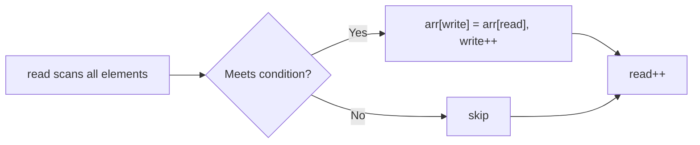

# Two Pointers Pattern Theory

This note explains the core idea behind **Two Pointers Pattern** in beginner-friendly language.

## Why this pattern matters

Two indices move through the array in a coordinated way. Instead of checking all pairs O(n²), you exploit order or maintain an invariant so each element is processed once — O(n).

## Core mental model

Two common variants:

1. **Opposite ends (converging):** `left` at start, `right` at end — works on sorted arrays or max-area problems.
2. **Same direction (read/write):** `read` scans, `write` marks where the next valid element goes — in-place filtering.

## Pattern diagram — converging pointers



### Converging example (sorted pair sum)

```
nums = [1, 2, 4, 6, 8], target = 8

        L           R
       [1, 2, 4, 6, 8]   sum=9 > 8 → R--
       [1, 2, 4, 6, 8]   sum=7 < 8 → L++
          [1, 2, 4, 6, 8] sum=8 ✓ → found (2, 6)
```

## Pattern diagram — read/write pointers



```
Remove duplicates in [1, 1, 2, 2, 3]

read:  0  1  2  3  4
write: 0
       [1, 1, 2, 2, 3]
        w,r → keep 1, write=1
           r → skip duplicate
              r → keep 2, write=2
                 r → skip
                    r → keep 3, write=3
Result length = 3 → [1, 2, 3, ...]
```

## Recognition clues

- Sorted array + pair / sum constraint
- In-place removal, move zeroes, merge sorted arrays
- Maximize something between two boundaries (container with water)

## Questions in this folder

- [Remove Duplicates from Sorted Array (#26)](https://leetcode.com/problems/remove-duplicates-from-sorted-array/)
- [Remove Element (#27)](https://leetcode.com/problems/remove-element/)
- [Merge Sorted Array (#88)](https://leetcode.com/problems/merge-sorted-array/)
- [Move Zeroes (#283)](https://leetcode.com/problems/move-zeroes/)
- [Squares of a Sorted Array (#977)](https://leetcode.com/problems/squares-of-a-sorted-array/)
- [Container With Most Water (#11)](https://leetcode.com/problems/container-with-most-water/)

## How to explain in interview

1. Mention brute force (nested loops or extra array).
2. State invariant: what `left`/`right` or `read`/`write` represent.
3. Explain why pointers only move forward — no missed cases.
4. Dry run one example with pointer positions drawn.
5. Complexity: O(n) time, O(1) extra space for in-place variants.
