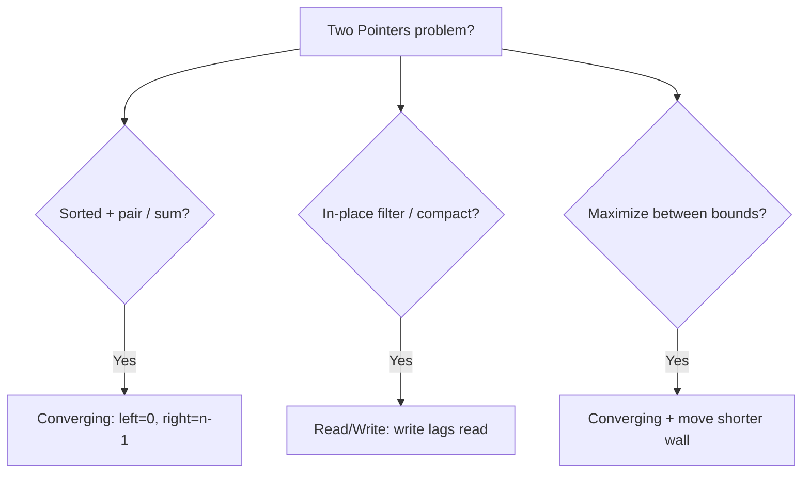

# Two Pointers Pattern Notes

## Top Interview Questions

- [Remove Duplicates from Sorted Array (#26)](https://leetcode.com/problems/remove-duplicates-from-sorted-array/)
- [Remove Element (#27)](https://leetcode.com/problems/remove-element/)
- [Merge Sorted Array (#88)](https://leetcode.com/problems/merge-sorted-array/)
- [Move Zeroes (#283)](https://leetcode.com/problems/move-zeroes/)
- [Squares of a Sorted Array (#977)](https://leetcode.com/problems/squares-of-a-sorted-array/)
- [Container With Most Water (#11)](https://leetcode.com/problems/container-with-most-water/)

## Visual summary — pick your variant

### Quick reference

| Variant | Pointer init | Move rule |
|---------|-------------|-----------|
| Converging sum | `left=0`, `right=n-1` | sum too small → `left++`, too big → `right--` |
| Read/Write | `write=0`, `read` scans | keep → copy to `write`, then `write++` |
| Merge from end | `i=m-1`, `j=n-1`, `k=m+n-1` | place larger at `k`, fill backwards |
| Container water | `left=0`, `right=n-1` | move pointer at shorter height |

## Revision in 5 minutes

- Identify variant: converging vs read/write vs merge-from-end.
- State invariant before coding.
- Dry run with pointer labels on the array.
- Edge cases: empty array, all duplicates, single element.
- Complexity: O(n) time, O(1) space for in-place.

## Revision in 1 minute

- Sorted pair → converging | In-place filter → read/write | Merge → fill from end

## Most Important Concepts

- **Invariant:** elements before `write` are the valid processed prefix.
- **Why converging works on sorted arrays:** moving the smaller end is the only way to increase/decrease sum.
- **Container water:** area limited by shorter line — moving that pointer might find a taller line.
