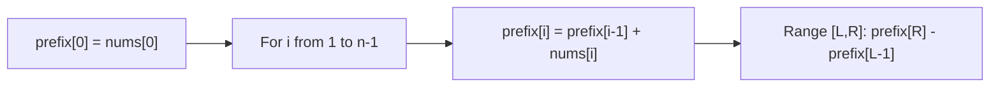
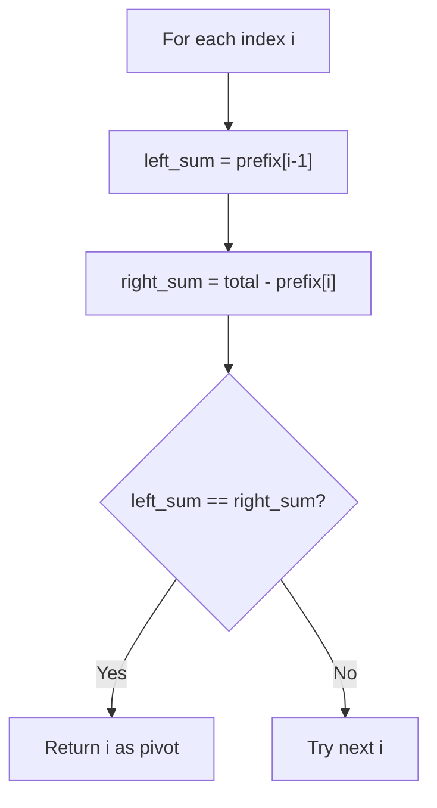

# Prefix Sum Pattern Theory

This note explains the core idea behind **Prefix Sum Pattern** in beginner-friendly language.

## Why this pattern matters

Many problems ask for the sum of a range `[L, R]`. Re-summing every range is O(n) per query. A prefix array precomputes cumulative totals so each range query is O(1).

## Core mental model

Define `prefix[i]` = sum of `nums[0..i]` (inclusive).

```
Range sum [L, R] = prefix[R] - prefix[L - 1]
(Special case: L = 0 → answer is prefix[R])
```

## Pattern diagram — building prefix



### Prefix array construction

```
nums:    [1,  2,  3,  4,  5]
index:    0   1   2   3   4

prefix:  [1,  3,  6, 10, 15]
          ↑   ↑   ↑
          |   |   └── prefix[2] = 1+2+3 = 6
          |   └────── prefix[1] = 1+2 = 3
          └────────── prefix[0] = 1
```

### Range query example

```
Query sum [1, 3] on nums = [1, 2, 3, 4, 5]

prefix[3] - prefix[0] = 10 - 1 = 9
(check: 2 + 3 + 4 = 9 ✓)
```

## Pivot index diagram



## Recognition clues

- "Sum of subarray from index L to R"
- "Find index where left sum equals right sum"
- Multiple range queries on a static array

## Questions in this folder

- [Running Sum of 1D Array (#1480)](https://leetcode.com/problems/running-sum-of-1d-array/)
- [Find Pivot Index (#724)](https://leetcode.com/problems/find-pivot-index/)
- [Range Sum Query - Immutable (#303)](https://leetcode.com/problems/range-sum-query-immutable/)

## How to explain in interview

1. Brute force: re-sum each range O(n) per query.
2. Bottleneck: overlapping subproblems in range sums.
3. Build prefix once O(n), answer queries O(1).
4. Dry run prefix build + one range query.
5. Space O(n) for prefix array.
