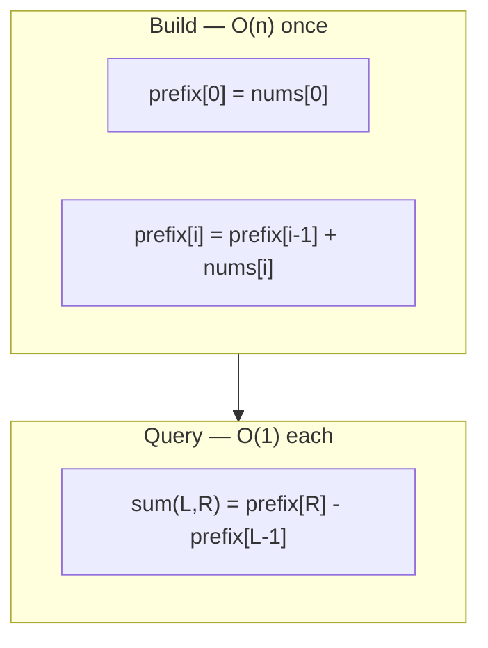

# Prefix Sum Pattern Notes

## Top Interview Questions

- [Running Sum of 1D Array (#1480)](https://leetcode.com/problems/running-sum-of-1d-array/)
- [Find Pivot Index (#724)](https://leetcode.com/problems/find-pivot-index/)
- [Range Sum Query - Immutable (#303)](https://leetcode.com/problems/range-sum-query-immutable/)

## Visual summary



### Prefix on a number line

```
nums:     3    4    1    2
          |----+----+----|
prefix:   3    7    8   10
          ↑         ↑
          L=0       R=2

sum(0,2) = prefix[2] = 8  (3+4+1)
sum(1,3) = prefix[3] - prefix[0] = 10 - 3 = 7  (4+1+2)
```

## Revision in 5 minutes

- Clue: range sum / left-right balance → prefix array.
- Build: `prefix[i] = prefix[i-1] + nums[i]`.
- Query: `prefix[R] - prefix[L-1]` (handle L=0).
- Pivot: `left = prefix[i-1]`, `right = total - prefix[i]`.
- Complexity: O(n) build, O(1) per query, O(n) space.

## Revision in 1 minute

- Cumulative sums → range query in O(1) → pivot = left sum equals right sum

## Most Important Concepts

- **Invariant:** `prefix[i]` always equals sum of `nums[0..i]`.
- **Off-by-one:** use `prefix[L-1]` only when L > 0.
- **Running sum (#1480):** prefix array *is* the answer — no separate query step.
