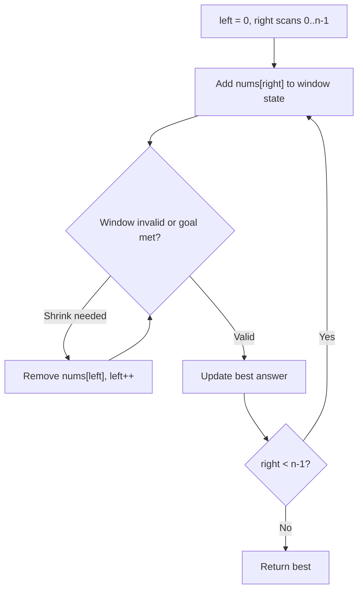
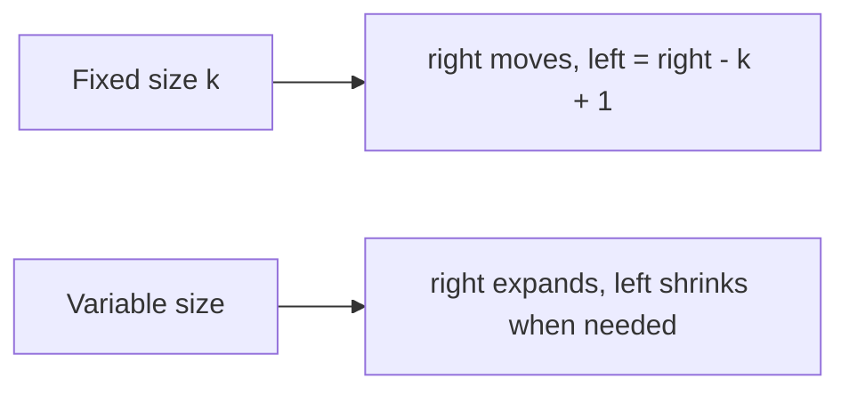

# Sliding Window Pattern Theory

This note explains the core idea behind **Sliding Window Pattern** in beginner-friendly language.

## Why this pattern matters

Subarray problems often check every window O(n²). A sliding window maintains a `[left, right]` range and updates it incrementally — each element enters and leaves at most once → O(n).

## Core mental model

1. Expand `right` to grow the window.
2. When the window violates a condition (or meets a goal), shrink from `left`.
3. Track the best valid window (max length, min length, max sum, etc.).

## Pattern diagram — variable window



### Window sliding on an array

```
nums = [2, 3, 1, 2, 4, 3], min subarray sum >= 7

Step 1: [2]           sum=2
Step 2: [2,3]         sum=5
Step 3: [2,3,1]       sum=6
Step 4: [2,3,1,2]     sum=8 ≥ 7 ✓ len=4
        shrink → [3,1,2] sum=6
        shrink → [1,2]   sum=3
        ...
Step 5: expand to [4] then [4,3] sum=7 ≥ 7 ✓ len=2  ← best
```

## Fixed vs variable window



## Recognition clues

- "Longest/shortest subarray with sum ≥ / ≤ / = X"
- "Maximum average of subarray of size k" (fixed window)
- Contiguous subarray constraint

## Questions in this folder

- [Maximum Average Subarray I (#643)](https://leetcode.com/problems/maximum-average-subarray-i/)
- [Minimum Size Subarray Sum (#209)](https://leetcode.com/problems/minimum-size-subarray-sum/)

## How to explain in interview

1. Brute force: all subarrays O(n²) or O(n³).
2. Bottleneck: recomputing window sum from scratch.
3. Slide window: add at `right`, remove at `left` — O(n).
4. Dry run with `left` and `right` marked on array.
5. State what window invariant you maintain.
