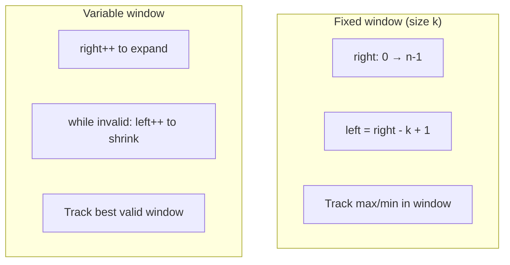

# Sliding Window Pattern Notes

## Top Interview Questions

- [Maximum Average Subarray I (#643)](https://leetcode.com/problems/maximum-average-subarray-i/)
- [Minimum Size Subarray Sum (#209)](https://leetcode.com/problems/minimum-size-subarray-sum/)

## Visual summary



### Window movement diagram

```
nums:  [ 2 | 3 | 1 | 2 | 4 | 3 ]
         ↑-------↑
        left   right     ← current window [2,3,1,2]

After right++:
       [ 2 | 3 | 1 | 2 | 4 | 3 ]
         ↑-----------↑
        left       right     ← window sum grew

After left++ (shrink):
       [ 2 | 3 | 1 | 2 | 4 | 3 ]
             ↑-------↑
            left   right     ← dropped leftmost element
```

## Revision in 5 minutes

- Clue: contiguous subarray + sum/count constraint → sliding window.
- Fixed k: slide both pointers together; variable: expand right, shrink left.
- Maintain window state (sum, count map, etc.) incrementally.
- Dry run: mark `left` and `right` at each step.
- Complexity: O(n) — each index visited at most twice.

## Revision in 1 minute

- Expand right → while invalid shrink left → update best → O(n)

## Most Important Concepts

- **Invariant:** window `[left, right]` always represents a contiguous subarray.
- **Fixed vs variable:** #643 uses fixed k; #209 uses variable until sum ≥ target.
- **Why O(n):** `left` and `right` only move forward — never backward.
