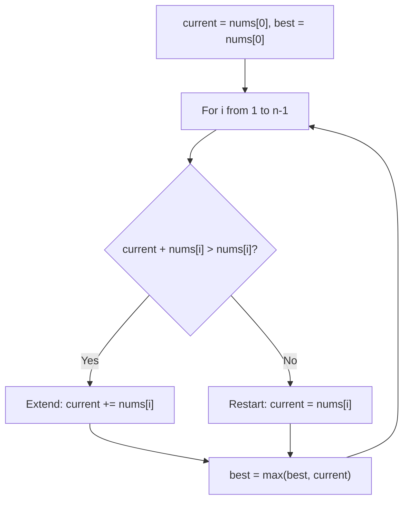

# Kadane's Algorithm Pattern Theory

This note explains the core idea behind **Kadane's Algorithm Pattern** in beginner-friendly language.

## Why this pattern matters

Maximum subarray sum appears constantly in interviews. Kadane's algorithm answers it in O(n) with a simple rule: at each position, decide whether to extend the current subarray or start fresh.

## Core mental model

At each index `i`:

```
current_sum = max(nums[i], current_sum + nums[i])
best = max(best, current_sum)
```

**Meaning:** if the running sum goes negative, dropping it and starting at `nums[i]` is always better.

## Pattern diagram



### Kadane dry run

```
nums = [-2, 1, -3, 4, -1, 2, 1, -5, 4]

i  | nums[i] | extend or restart? | current | best
---|---------|--------------------|---------|-----
0  |   -2    | start              |   -2    |  -2
1  |    1    | restart (1 > -1)   |    1    |   1
2  |   -3    | extend (-2)        |   -2    |   1
3  |    4    | restart (4 > 1)    |    4    |   4
4  |   -1    | extend             |    3    |   4
5  |    2    | extend             |    5    |   5
6  |    1    | extend             |    6    |   6  ← answer
7  |   -5    | extend             |    1    |   6
8  |    4    | extend             |    5    |   6
```

### Subarray visualization

```
nums:  [-2,  1, -3, [ 4, -1,  2,  1 ], -5,  4]
                      └──── max sum = 6 ────┘
```

## Recognition clues

- "Maximum sum contiguous subarray"
- Allow negative numbers
- Single pass, O(n) expected

## Questions in this folder

- [Maximum Subarray (#53)](https://leetcode.com/problems/maximum-subarray/)

## How to explain in interview

1. Brute force: all subarrays O(n²).
2. Bottleneck: recomputing sums.
3. Kadane: local decision at each index — extend or restart.
4. Dry run table (see above).
5. O(n) time, O(1) space.
