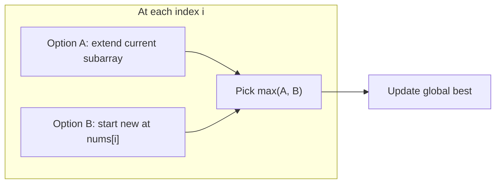

# Kadane's Algorithm Pattern Notes

## Top Interview Questions

- [Maximum Subarray (#53)](https://leetcode.com/problems/maximum-subarray/)

## Visual summary



### Extend vs restart

```
nums = [ -1,  5, -2,  3 ]

At i=1 (value 5):
  extend: -1 + 5 = 4
  restart: 5
  → pick 5 (restart wins)

At i=3 (value 3):
  extend: 5 + (-2) + 3 = 6
  restart: 3
  → pick 6 (extend wins)  ← best so far
```

## Revision in 5 minutes

- Clue: max sum contiguous subarray → Kadane.
- Template: `current = max(x, current + x)`, `best = max(best, current)`.
- Key insight: negative running sum is never worth keeping.
- Edge cases: all negative → answer is the largest single element.
- Complexity: O(n) time, O(1) space.

## Revision in 1 minute

- At each x: extend or restart → track best → O(n) O(1)

## Most Important Concepts

- **Invariant:** `current` is the best sum of a subarray ending at index `i`.
- **Why restart works:** any subarray with negative prefix sum can be improved by dropping it.
- **All negatives:** Kadane still works — `best` tracks the least negative value.
