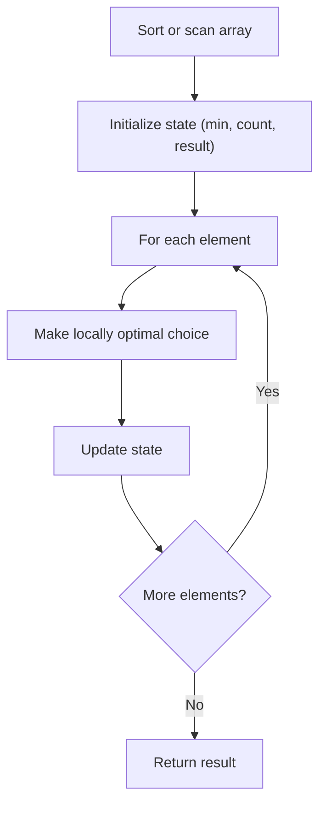

# Greedy on Arrays Pattern Theory

This note explains the core idea behind **Greedy on Arrays Pattern** in beginner-friendly language.

## Why this pattern matters

Some array problems have a locally optimal choice that leads to a globally optimal answer. Greedy avoids exploring all possibilities when you can prove the safe move at each step.

## Core mental model

1. Process elements in a meaningful order (left-to-right, or by value).
2. At each step, make the best local decision.
3. Prove (or state) why local optimum → global optimum.

## Pattern diagram — general greedy flow



### Stock profit (buy low, sell later)

```
prices = [7, 1, 5, 3, 6, 4]

Day:    0   1   2   3   4   5
Price:  7   1   5   3   6   4
            ↑buy    ↑sell
            buy at 1, sell at 6 → profit = 5

Greedy: track min price so far, max profit = max(price - min_so_far)
```

### Boyer-Moore majority vote

```
nums = [2, 2, 1, 1, 1, 2, 2]

Step     | candidate | count
---------|-----------|------
see 2    |     2     |   1
see 2    |     2     |   2
see 1    |     2     |   1
see 1    |     2     |   0  → reset
see 1    |     1     |   1
see 2    |     1     |   0  → reset
see 2    |     2     |   1  → candidate = 2 (majority)
```

## Recognition clues

- "Best time to buy/sell" → track min so far
- "Majority element" → cancel votes (Boyer-Moore)
- "Product except self" → prefix × suffix passes
- "Next permutation" → find pivot, swap, reverse suffix

## Questions in this folder

- [Best Time to Buy and Sell Stock (#121)](https://leetcode.com/problems/best-time-to-buy-and-sell-stock/)
- [Majority Element (#169)](https://leetcode.com/problems/majority-element/)
- [Product of Array Except Self (#238)](https://leetcode.com/problems/product-of-array-except-self/)
- [Next Permutation (#31)](https://leetcode.com/problems/next-permutation/)

## How to explain in interview

1. Brute force: all pairs or all permutations.
2. Identify greedy property: why one local choice is safe.
3. Walk through state updates on one example.
4. Mention proof sketch if asked (e.g., majority cancels non-majority).
5. State time/space complexity.
