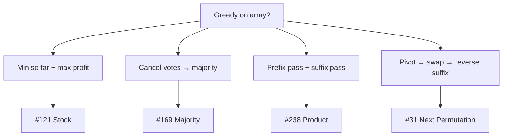

# Greedy on Arrays Pattern Notes

## Top Interview Questions

- [Best Time to Buy and Sell Stock (#121)](https://leetcode.com/problems/best-time-to-buy-and-sell-stock/)
- [Majority Element (#169)](https://leetcode.com/problems/majority-element/)
- [Product of Array Except Self (#238)](https://leetcode.com/problems/product-of-array-except-self/)
- [Next Permutation (#31)](https://leetcode.com/problems/next-permutation/)

## Visual summary — greedy strategies



### Product except self — two passes

```
nums = [1, 2, 3, 4]

Prefix products (left to right):
  [1,  1,  2,  6]
   ↑   ↑   ↑   ↑
   1  1×1 1×2 1×2×3

Suffix products (right to left):
  [24, 12,  4,  1]
    ↑    ↑   ↑   ↑
  2×3×4 3×4  4   1

answer[i] = prefix[i-1] × suffix[i+1]
  → [24, 12, 8, 6]
```

## Revision in 5 minutes

- Match problem to greedy strategy (see diagram).
- Stock: `min_price`, `max_profit = max(max_profit, price - min_price)`.
- Majority: Boyer-Moore cancel pairs.
- Product: prefix left + suffix right, no division.
- Next permutation: rightmost ascent → swap with successor → reverse tail.

## Revision in 1 minute

- Local best choice each step → prove it’s globally optimal → O(n)

## Most Important Concepts

- **Invariant:** greedy state always reflects the best decision up to current index.
- **Product (#238):** output[i] = product of all elements except i = prefix × suffix.
- **Next permutation (#31):** find smallest increase by swapping pivot with next larger element.
