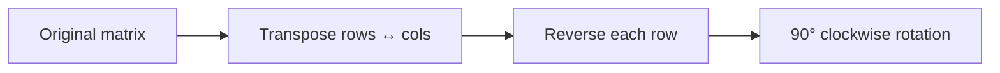
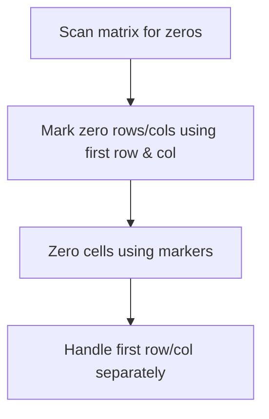

# Matrix Pattern Theory

This note explains the core idea behind **Matrix Pattern** in beginner-friendly language.

## Why this pattern matters

Matrix problems test whether you can navigate 2D structure efficiently — row/column traversal, in-place transforms, and layer-by-layer thinking — without wasting O(m×n) extra space when unnecessary.

## Core mental model

1. **Traversal:** nested loops over rows and columns; sometimes process boundaries (spiral, layers).
2. **In-place transform:** use rows/columns as markers or transpose + reverse.
3. **Coordinate math:** `(r, c)` → `(c, n-1-r)` for 90° clockwise rotation.

## Pattern diagram — rotate image (transpose + reverse)



### Rotate 90° clockwise step by step

```
Original:          Transpose:         Reverse rows:
1 2 3            1 4 7              7 4 1
4 5 6     →      2 5 8       →      8 5 2
7 8 9            3 6 9              9 6 3
```

## Pattern diagram — set matrix zeroes



### Zero marking idea

```
Before:              Markers:             After:
1 0 3               x 0 x                  0 0 0
4 5 6        →      0 5 6         →        0 0 0
0 8 9               0 8 9                  0 0 0

Use row0/col0 as flags: matrix[i][0]=0 or matrix[0][j]=0 means zero that row/col
```

## Recognition clues

- "Rotate image in-place"
- "Set entire row/column to zero if cell is zero"
- 2D grid traversal, layers, diagonals

## Questions in this folder

- [Rotate Image (#48)](https://leetcode.com/problems/rotate-image/)
- [Set Matrix Zeroes (#73)](https://leetcode.com/problems/set-matrix-zeroes/)

## How to explain in interview

1. Brute force: extra matrix O(m×n) space.
2. Optimize: transpose + reverse (rotate) or first-row/col markers (zeroes).
3. Draw 3×3 example showing each step.
4. Watch edge cases: first row/column overlap in #73.
5. O(m×n) time, O(1) extra space for optimal solutions.
