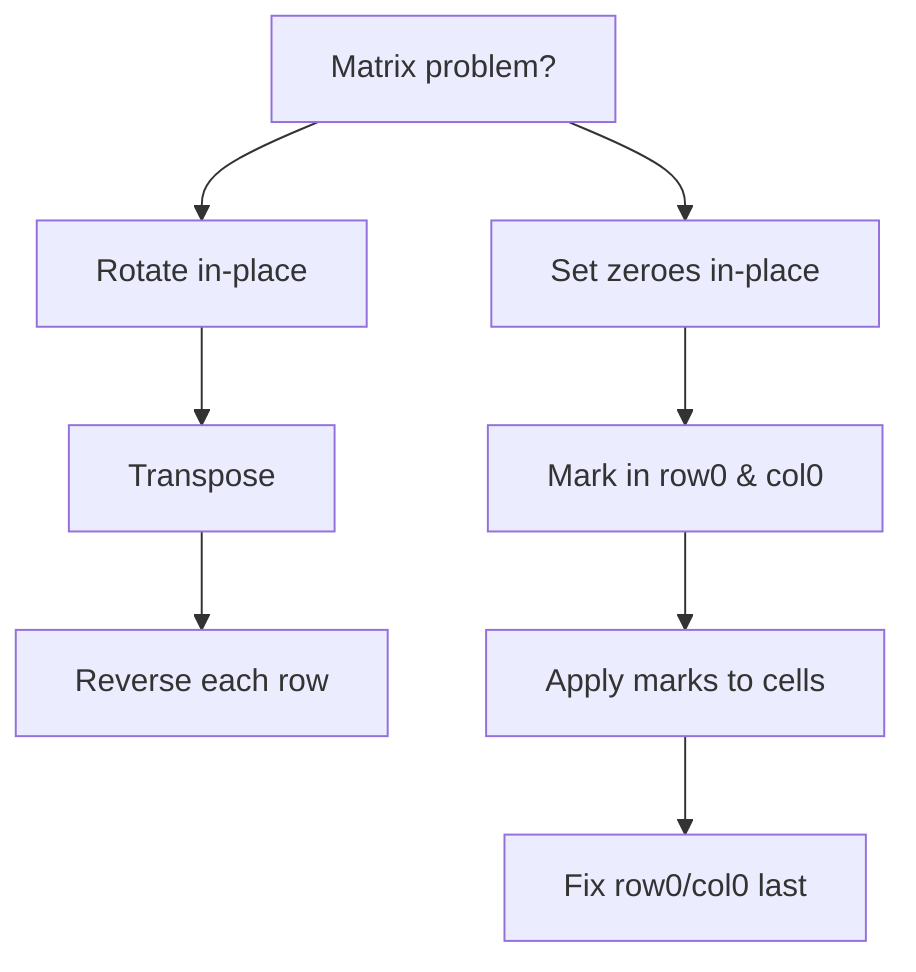

# Matrix Pattern Notes

## Top Interview Questions

- [Rotate Image (#48)](https://leetcode.com/problems/rotate-image/)
- [Set Matrix Zeroes (#73)](https://leetcode.com/problems/set-matrix-zeroes/)

## Visual summary



### Coordinate rotation map

```
90° clockwise: (r, c) → (c, n - 1 - r)

(0,0)→(0,2)   (0,1)→(1,2)   (0,2)→(2,2)
(1,0)→(0,1)   (1,1)→(1,1)   (1,2)→(2,1)
(2,0)→(0,0)   (2,1)→(1,0)   (2,2)→(2,0)
```

### Layer traversal (general technique)

```
┌─────────────┐
│ → → → → → ↓ │   Process outer layer first,
│ ↑         ↓ │   then shrink boundaries inward.
│ ↑         ↓ │
│ ← ← ← ← ← ↓ │
└─────────────┘
```

## Revision in 5 minutes

- Rotate (#48): transpose → reverse each row. Square matrix only.
- Zeroes (#73): use first row/col as markers; track if row0/col0 had zero originally.
- Draw 3×3 before/after for rotate.
- Edge cases: 1×1 matrix, single row, single column.
- Complexity: O(m×n) time, O(1) extra space.

## Revision in 1 minute

- Rotate: transpose + reverse rows | Zeroes: mark in edges → apply → fix edges

## Most Important Concepts

- **Invariant (rotate):** transpose swaps (r,c)↔(c,r); row reverse completes 90° turn.
- **Invariant (zeroes):** markers in row0/col0 record which rows/cols must become zero.
- **Trap in #73:** don't zero row0/col0 until the end — they are the marker storage.
